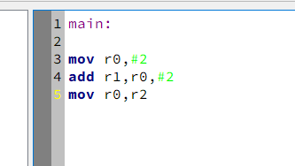
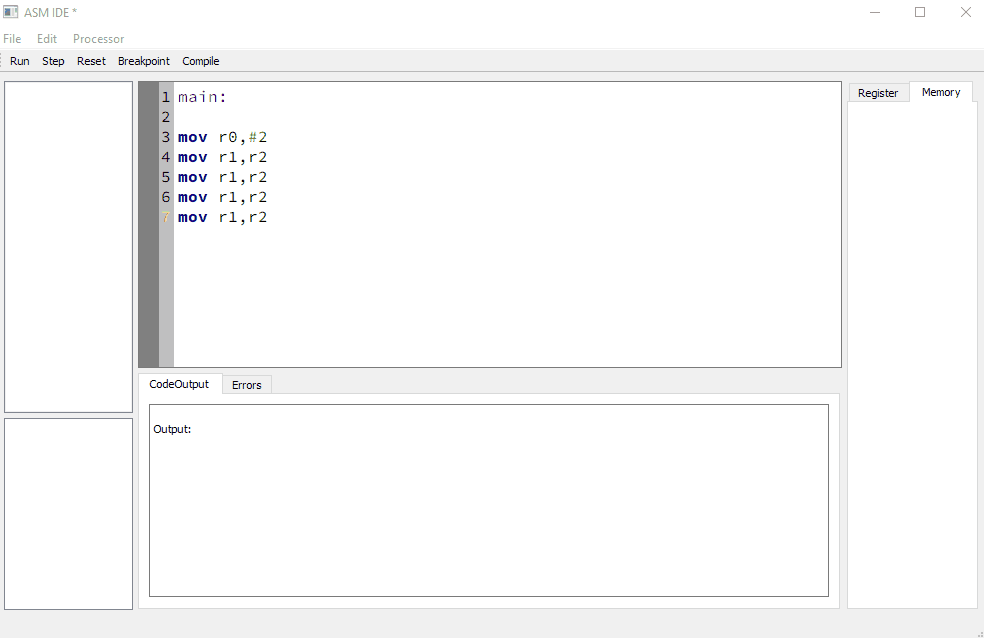

# ArmSimulator V 0.1

This project is for educational purposes.
The final product will represent a Simulator for basic ARM processor behavior. The first version aims at comepletely emulating the ARMv4 infrastructure and the complete instruction set.

### Planned Features
- More Commands
- Fixing the whitespace issue ( you can't add any whitespace before a command)
- Register Preview
- Memory Preview
- Using the added console output window
- Adding an error listener to the parser for error highlighting
- Using the error list to indicate Errors inside of commands
- Add basic patterns in the menu for easy access and insertion in the code (WHILE, FOR, IF ELSE, SWITCH)

### Far future plans
- Add autocompletion for assembly language
- Reallocate semantics to external linter library
- Add optimization hints to the code

# Current Features

### General
- Compiling the program to a high level instruction sequence for the processor
- Almost complete arm instruction set recognition for the ArmParser
- Implemented commands
  - MOV, MVN
- Conditional execution

### Gui
- Marking the line that is going to be executed on a step command
- Basic Syntax highlighting for the ARM assembly language
- Cstyle Comments everywhere

- Adding breakpoints via mouse and context menu
- working console window ( currently not used but its printing "Output:" and is tested to be working)

#### Quality of Life
- Warning for unsaved files 
- Basic shortcuts for every action. And standard shortcuts that everyone expects to work
- A list that displays recent files that can be opened with clicking on them

## Preview Gifs
### File management

### Debugger preview

## Fun with Lexing
### The basic behavior of the Lexer for correctly parsing ARM assembly files

### A really really long preview of an AST for an assembly program

